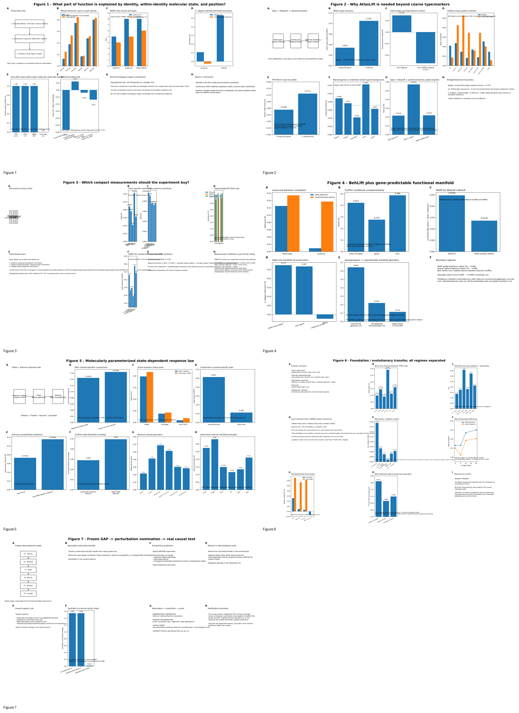
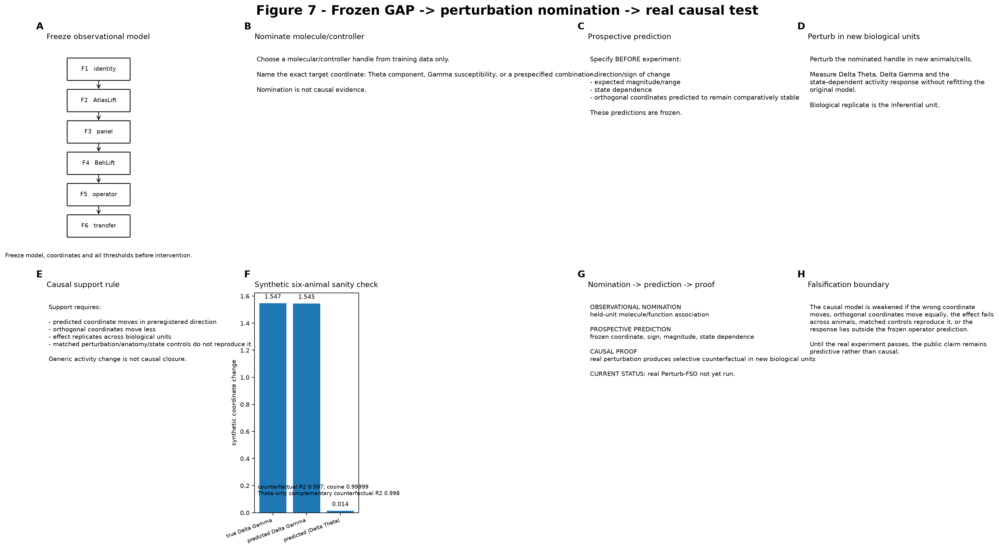

# Figure guide — historical requirement layouts and current browser authority

> **Current browser-facing Figure 1–3 authority: 2026-10-04.** Use the [scientific results page](../index.html), [v18 authority](current/CURRENT_FIG123_AUTHORITY_V18_20261004.md), and [compact source data](source_data/20261004/).
> The v3 graphics below are retained as **historical requirement layouts**. They remain useful for panel-design provenance but no longer define the current numerical authority.

**Important boundary:** Figure 7 is prospective/synthetic only. It is not experimental causal evidence.

## Figure 1 — What part of function is explained by identity, within-identity molecular state, and position?

The figure now makes the hierarchy explicit rather than treating “genes” as one undifferentiated predictor.

- **A — three-layer law:** discrete identity/type → continuous molecular state inside identity → position/local region context.
- **B — mouse hierarchy:** for Xu/PVH Ghrelin response, type → type+genes changes R² **0.1259→0.2492**, rho **0.3774→0.5299**, AUROC **0.7465→0.8470**. For Bugeon/VISp running-state response, R² **0.1668→0.1783**, rho **0.4806→0.5170**, AUROC **0.8027→0.8337**.
- **C — WARP actual cell types:** across eight functional axes, within-type continuous molecular state gives positive Δrho in 8/8, positive ΔAUROC in 8/8 and positive ΔR² in 5/8; matched-null significance is 4/8, 5/8 and 6/8, respectively.
- **D — C. elegans boundary:** hard identity can dominate. Pumping identity R² is **0.1067**, velocity identity R² **0.5328**, and within-identity molecular residual adds approximately zero.
- **E — frequency summary:** the cross-system question is how often continuous molecular state adds information below identity, not whether every dataset must be positive.
- **F/G — position and homologous-region boundary:** mouse same-region transfer is not automatically stronger than different-region/same-superclass transfer; WARP region effects are heterogeneous. A strict homologous-region winner comparison remains gated until source/target semantic axis, cells, held unit and metric are exactly matched.

**Figure 1 claim:** identity is the first molecular-functional coordinate; continuous molecular state can add a second layer; position modifies where that axis is expressed. Gross anatomical homology alone does not define the conserved object.

## Figure 2 — Why is AtlasLift needed beyond coarse type/markers?

AtlasLift is now shown as a **bridge-first molecular-completion test**, not generic feature expansion.

- **A — representation ladder:** hard type/sparse markers → continuous AtlasLift state → optional anatomy/space expert.
- **B — within-type recovery:** Bugeon within-type ordering AUROC **0.654→0.705** (+0.051).
- **C — correspondence control:** real cell-to-atlas mapping gives functional-prior ΔR² **+0.0146**; row-shuffled mapping gives **−0.0271**.
- **D — unified visual benchmark:** Bugeon and Allen VC2P are scored under the same held-unit, multi-metric contract. Eight of nine prespecified headline metrics improve; Allen Visual Behavior is retained as a calibration-versus-order boundary.
- **E — PVH Mc4r:** adding atlas-inferred **Mc4r** to the fixed nine-gene Xu panel changes Ghrelin R² **0.2589→0.2711** (Δ **+0.01223**, random-gene p=0.00995); extreme AUROC increases by +0.00349 (p=0.0149). Exact-PVH restriction preserves a positive ΔR² of **+0.00725**.
- **F — gene specificity:** Gabra4, Prkacb, Mc4r and Kirrel3 clear their matched random-gene logic; Cacna2d3 is retained as a specificity control.
- **G — optional space expert:** WARP gene-only R² **0.0216**, real spatial-neighborhood arm **0.0572**, coordinate-shuffle **0.0220**. Space enters only when the real coordinates beat the shuffle.
- **H — headroom boundary:** Bugeon has a strong VISp bridge; Xu/PVH has a better region-matched bridge but limited broad-lift headroom; C. elegans has a usable bridge but little full-panel molecular headroom.

**Current Bugeon add-gene contract:** measured-only R² **0.03349** / rho **0.21718**; +100 targeted atlas-only genes R² **0.03770** / rho **0.23326**. Larger panels are non-monotonic. The older 0.186→0.201 curve belongs to a different contract and is not the current figure authority.

## Figure 3 — Which compact measurements should the experiment buy?

Figure 3 now separates **set-level molecular completion, gene-specific nomination, compact panel design and prospective assay validation**.

- **A/B — discovery chain and nested single-gene null:** promoted computational nominations are Gabra4, Prkacb, Mc4r and Kirrel3; Cacna2d3 remains a negative/specificity control.
- **C — exact anatomy:** Gabra4 and Prkacb retain positive ΔR² in exact VISp; Mc4r and Kirrel3 retain positive ΔR² in exact PVH.
- **D — independent fixed-budget M1 Patch-seq benchmark:** at K=25, FSO-joint R² **0.3686**, PERSIST **0.3266**, random **0.1892**, sBNN **0.3691**; at K=50, FSO-joint **0.3804** vs PERSIST **0.3457**; at K=100, FSO-joint **0.3740**, functional-topK **0.3773**, PERSIST **0.3413**.
- **E — Pareto view:** panel design must jointly consider functional information, operator/shape preservation, redundancy and assay budget. No selector is declared universally best.
- **F — WARP receptor/effector panel:** on the phenotype that is actually present in Dataset 2, 13 receptors reach LOFO extreme AUROC **0.532**, three classical markers **0.493**, eight transmitter-identity genes **0.499**, five neuropeptides **0.478**, the full 31-gene panel **0.555**.
- **G — prospective PVH assay:** Ghrelin vs saline, Fos/cFos + Mc4r/Kirrel3 + matched random genes + original identity markers + local anatomy.
- **H — measurement reliability:** the cx43 technical replicate establishes that predictor-side gene noise is part of the explainable-variance ceiling.

## Figure 4 — BehLift plus a gene-predictable functional manifold

The manifold is treated as a held-unit prediction target, not a decorative embedding.

- **A — leave-one-behavior completion:** in C. elegans, molecular/class identity can rescue dimensions poorly inferred from the remaining behavior battery.
- **B — Xu/PVH conditional complementarity:** other ten states R² ≈**0.422**, genes ≈**0.276**, joint ≈**0.486**; conditional molecular ΔR² **+0.0639**, matched-null p=0.00498, Δ extreme-AUROC **+0.0273**.
- **C — WARP D2 AtlasLift×BehLift:** OMR-backward conditional ΔR² **+0.024776** and Δ extreme-AUROC **+0.013643**, both above the matched lifted-feature shuffle (p=0.00990).
- **D — held-worm manifold:** direct multi-output molecular prediction R² **0.274**; three-PC latent reconstruction **0.267**; molecular shuffle **−0.024**.
- **E — gene-family→geometry result:** WARP cross-animal functional geometry has median Spearman **0.643**. Neuromodulator/neuropeptide family-distance predicts functional-subspace distance with pooled rho **0.219**, positive in all three fish (**0.222–0.261**) and within-fish permutation p<0.005. TF, adhesion/guidance and synaptic-effector families do not show the same reproducible positive relationship.
- **F — boundary regimes:** WARP and Shainer global eight-behavior latent R² values are near −0.006; Neuroplex is approximately null. Selected functional axes can be predictable even when there is no single global gene-predictable manifold.

## Figure 5 — Molecularly parameterized state-dependent response law

Figure 5 now keeps the operator question separate from scalar molecular prediction.

- **A — response law:** Theta captures stable response geometry; Gamma captures state/context susceptibility.
- **B — main operator comparison:** independent Ridge heads joint held-mouse R² **0.14454** → shared low-rank operator **0.16356**, while parameters decrease from ≈438 to ≈220.5 (**~49.7% fewer**); 3/4 held mice improve.
- **C — matched stress tests:** response-shape geometry **0.19822→0.21721**; 16-target operator **0.03774→0.04280**; strict 24-D state-kernel stress test **0.00927→0.01852**. The 24-D result is not the overall operator headline.
- **D — conservation gate:** mean gene AUROC is ≈**0.657** on conserved operator axes versus ≈**0.456** on the other axes. The rule is therefore conserved-vs-animal-specific, not a universal “shape > gain” slogan.
- **E — Gamma prediction:** type lookup R² ≈**0.0732**; type + BrainBeacon4 + Atlas8 + receptor6 reaches ≈**0.11546**, with 4/4 held animals positive.
- **F — independent Xu/PVH susceptibility:** amplitude variability ΔR² **+0.0580** and total state range **+0.0990**, both 3/3 mice with matched-null p=0.00498.
- **G — reverse geometry:** NuCLR balanced accuracy **0.4429** → +shape **0.4824** → +shape+gain **0.5173**, with generic-summary, matched-dimensional and wrong-neuron controls.
- **H — gene-level reverse manifold:** gene readability is heterogeneous; the full 72-gene distribution is not summarized by one mean.

## Figure 6 — Foundation / evolutionary transfer with the regimes separated

Figure 6 is no longer one transfer leaderboard. It deliberately separates what is and is not matched.

- **A — contracts:** strict zero-shot, exact matched representation, mechanism/ablation, few-shot and mammalian/primate evolutionary geometry are distinct tests.
- **B — strict zero-shot TF64 six-direction map:** held-target Spearman rho is mouse→fish **0.09766**, fish→mouse **0.14599**, mouse→worm **0.09049**, worm→mouse **0.29161**, fish→worm **0.11236**, worm→fish **0.16082**.
- **C — semantic axes:** selected mouse/fish/worm semantic transfers survive target-group-preserving permutation/FDR, but reverse directions can be null or negative. They are not averaged into one universal transfer score.
- **D — exact matched Zhao→WARP comparison:** **PENDING FINAL PUBLIC NUMERIC FREEZE.** TF64, BrainBeacon, LangPatch and GAP are not placed into a winner table until target cells, semantic axis, held-fish split and metric are exactly identical. LangPatch is explicitly a local frozen TF-IDF+SVD function-text surrogate in the current audit.
- **E — mechanism/ablation:** contextual TranscriptFormer geometry is stronger than static geometry on the validated locomotor/visual-motor transfer; developmental-TF ablation exceeds matched-random ablation. Program gating is axis-specific and does not replicate uniformly across datasets.
- **F — few-shot:** WARP→Shainer zero-shot remains near chance; support appears with target calibration. Bugeon V2.2 sample efficiency is displayed as a separate same-system contract.
- **G — hybrid boundary:** BrainBeacon/TranscriptFormer additions do not act as generic additive upgrades to V2.2 on the matched Bugeon shape-PC1 endpoint.
- **H — primate geometry:** TranscriptFormer zero-shot homology retrieval top1 is mouse→macaque **0.81065**, mouse→human **0.66617**, macaque→human **0.69872**. This validates evolutionary gene geometry, not functional transfer by itself.
- **I — Pharaoh ant:** **MISSING/PENDING.** No frozen traceable local authority was found in the current repository audit, so the required control remains visibly incomplete rather than being fabricated.

The current supported claim is narrower than a universal foundation model: selected molecular-functional programs can transfer when the semantic axis and molecular geometry are biologically aligned.

## Figure 7 — Frozen GAP → perturbation nomination → real causal test

**Status: prospective/synthetic only.** Figure 7 makes the causal promotion rule explicit.

- **A — freeze observational model:** Figures 1–6 define candidate coordinates; model, thresholds and coordinates are frozen before intervention.
- **B — nominate a handle:** choose a molecule/controller from training data only and name the exact Theta/Gamma coordinate.
- **C — prospective prediction:** sign, expected magnitude/range, state dependence and orthogonal coordinates are specified before the experiment.
- **D — perturb new biological units:** measure ΔTheta, ΔGamma and state-dependent activity without refitting the original model.
- **E — causal support rule:** the predicted coordinate must move in the preregistered direction, orthogonal coordinates must move less, the effect must replicate across biological units and matched controls must not reproduce it.
- **F — synthetic sanity check:** Gamma-only true ΔGamma **1.547**, predicted **1.545**, predicted orthogonal |ΔTheta| **0.014**, counterfactual response R² **0.997**, cosine **0.99999**; the complementary Theta-only simulation gives R² **0.998**.
- **G/H — proof boundary:** nomination and prospective prediction are not causal proof. Real perturbation data must pass the selective counterfactual test.

Until the real Perturb-FSO experiment passes, the public claim remains predictive rather than causal.
