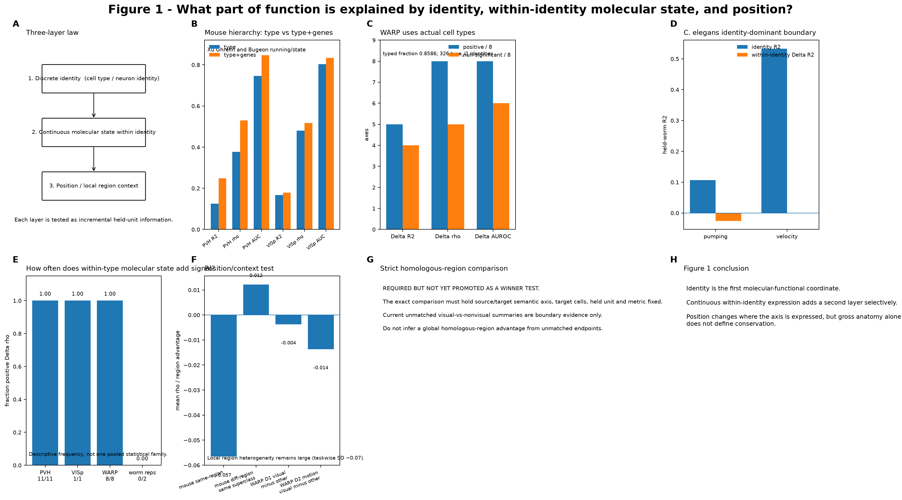

# Q1 — Which components of in-vivo neural function are molecularly specified?

> **Current 2026-10-04 browser authority:** [Figure 1 on the scientific results page](../../index.html#fig1) · [source data](../../docs/source_data/20261004/FIG1_MULTIAXIS_AUTHORITY_V3.csv) · [v18 authority](../../docs/current/CURRENT_FIG123_AUTHORITY_V18_20261004.md).

The older v3 image below is retained as a historical requirement layout, not the current numerical authority.

### 2026-10-04 result lock

Figure 1 is **multi-axis**, not an R² leaderboard. Bugeon is gene/type-rich (genes rho≈0.398; type≈0.386; space≈0.040), Xu favors continuous genes over coarse identity (≈0.338 vs ≈0.201), while Shainer is spatial (space≈0.261; genes≈0.032). Zhao shows why metrics stay separate: connectivity vs type has only ΔR²≈+0.0011 but ΔSpearman≈+0.1269, ΔAUROC≈+0.0660 and ΔAUPRC≈+0.1072. Relation-index inference now uses the target-validity-cleaned contract: 29 valid inferential rows, 11 FDR-supported; two MERGE QC-metadata pseudo-targets are excluded.

## Biological question

A molecular label is stable, whereas neural activity is state- and context-dependent. We therefore ask **which functional objects generalize across biological replicates and remain readable from molecular identity** rather than whether genes reconstruct every activity value.

## Functional targets

The same phenotype is viewed at several resolutions: continuous amplitude, response sign, responsive/non-responsive status, functional extremes, ordinal rank, normalized response shape, and—where repeated states exist—state susceptibility.

## Core comparison

`context-only → hard type → continuous molecular state → type + continuous molecular state`

The strongest test of information below taxonomy removes the training-fold type mean and asks whether continuous molecular residuals predict the held-out functional residual.

## Main datasets

Bugeon VISp, Xu/PVH, WARP zebrafish, Zhao VISp, Condylis S1, class-linked *C. elegans*, and compatible Allen visual-system controls.

## Baselines

- intercept/context-only predictor;
- hard class/type predictor;
- Ridge/ElasticNet specialist;
- nonlinear or low-rank models only after the simple baseline is established.

## Inference

Outer evaluation is animal/fish/worm held out. Cell-level sample size is descriptive; it is not the biological replicate count. Rank/classification and calibration are reported together rather than selecting the metric that looks best.

## Canonical entry points

- `scripts/114_target_formulation_scorecard.py`
- `scripts/115_type_gene_function_decomposition.py`
- `scripts/102_bugeon_lowdim_state_controller.py`
- `scripts/106_state_controller_authority_v2.py`

## Biological interpretation

A positive Q1 result means molecular state constrains a reproducible functional coordinate. It does **not** imply that every instantaneous activity fluctuation is genetically specified or that a single coding regime applies across brain regions.
## Current result anchors

Representative held-biological-unit results show why the target hierarchy matters. In Bugeon VISp, continuous state modulation is predicted at R² ≈ 0.183, while sign AUROC is ≈ 0.752 and extreme-response AUROC ≈ 0.775. Xu/PVH reaches R² ≈ 0.270 and extreme-response AUROC ≈ 0.843. Class-linked C. elegans reaches R² ≈ 0.517 and extreme-response AUROC ≈ 0.869.

The stronger claim is below hard taxonomy. In the current within-type audit, Bugeon has 4/5 populations, Xu 2/4, and WARP 13/80 populations above their own p95 matched within-type null (binomial p=1.64e-4); only one WARP population is individually nameable after the stricter per-type multiplicity step. Normalized response shape is also reproducibly molecularly readable in Bugeon (R² ≈ 0.190), Xu (≈ 0.259), and more weakly WARP (≈ 0.073 at the validated reliability threshold).

These values are anchors for the biological contrast, not a universal leaderboard: calibration, rank/order, and within-type residual structure answer different questions.

## Reproduction note

Start with the target-formulation scorecard, then run the type-versus-continuous decomposition on the identical biological split. Only after those two steps should higher-capacity models be compared. See docs/ANALYSIS_CONTRACT.md for the split/null rules and docs/RESULTS_AT_A_GLANCE.md for the manuscript-level summary.

## Data provenance

Exact public sources, molecular-evidence tiers, and question eligibility are summarized in [the question-centric data matrix](../../docs/QUESTION_DATA_MATRIX.md).

## New target class: cross-state functional envelope

The Xu/PVH analysis adds a target class between static response shape and a fully specified dynamic operator. Continuous genes predict cross-state amplitude variability and total state range beyond hard molecular type under held-mouse evaluation and within-animal × type correspondence shuffles (ΔR² +0.058 and +0.099; 3/3 mice; empirical p=0.00498 for both). This supports the broader Q1 principle that the molecularly recoverable object can be a **functional envelope**—how much a cell can vary across conditions—even when finer condition-specific temporal details are not well calibrated.

## Model-capacity stress test

The biological conclusion does not depend on one estimator family. On the same Bugeon continuous target, held-animal R² is approximately 0.156 for Ridge, 0.180 for ElasticNet and 0.187 for ExtraTrees; extreme-response AUROC is approximately 0.826 for Logistic and 0.833 for ExtraTrees. On Xu Ghrelin response, Ridge/ElasticNet/ExtraTrees are approximately 0.259/0.273/0.253 R², with extreme-response AUROC approximately 0.865/0.870 for Logistic/ExtraTrees.

These comparisons are capacity checks, not a global model ranking: the target/split/metric are kept fixed so the inference is about the molecular signal, not the model name.

## Historical v3 figure-contract readout

The historical v3 Figure 1 panel contract was stricter than the earlier “gene scorecard” summary; the 2026-10-04 browser authority above supersedes its numerical status. It explicitly separates three layers: **hard identity → continuous molecular state inside identity → position/region context**.

- Xu/PVH Ghrelin: type → type+genes gives R2 **0.1259→0.2492**, rho **0.3774→0.5299**, AUROC **0.7465→0.8470**.
- Bugeon/VISp running-state: R2 **0.1668→0.1783**, rho **0.4806→0.5170**, AUROC **0.8027→0.8337**.
- WARP actual cell types: across eight functional axes, Delta rho and Delta AUROC are positive in 8/8, Delta R2 in 5/8; matched-null significance is 5/8, 6/8 and 4/8 respectively.
- C. elegans is an identity-dominant boundary: pumping identity R2 **0.1067**, velocity identity R2 **0.5328**, with approximately zero within-identity molecular residual.
- Position is treated as a modifier. Mouse same-region transfer is not automatically stronger than different-region/same-superclass transfer, and WARP shows no global homologous-visual-region advantage under the currently matched analyses.

The strict homologous-region winner comparison remains pending until source/target semantic axis, target cells, held unit and metric are exactly identical.
