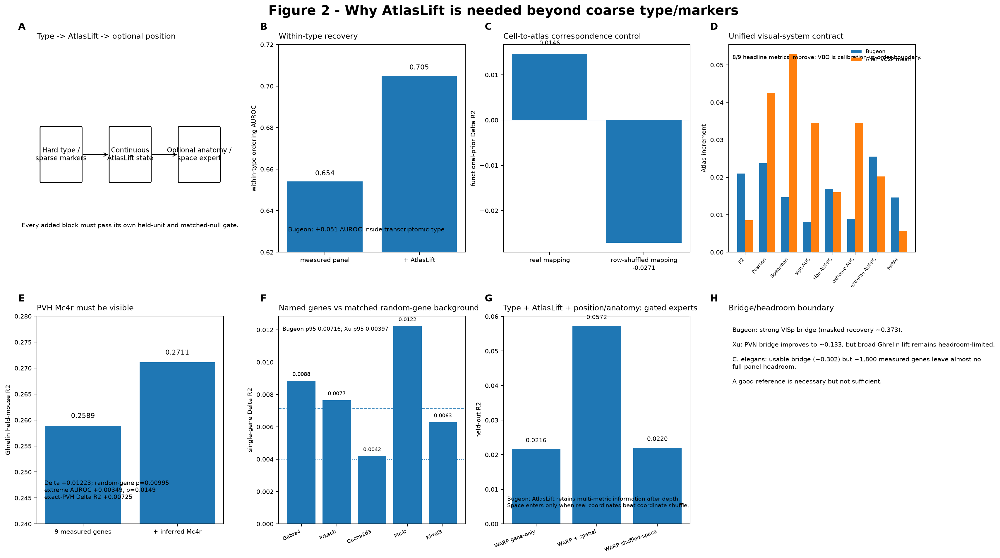

# Q2 — When can missing molecular state be recovered from a sparse functional experiment?

> **Current 2026-10-04 browser authority:** [Figure 2 on the scientific results page](../../index.html#fig2) · [geometry source data](../../docs/source_data/20261004/FIG2_ATLASLIFT_GEOMETRY_HEADROOM.csv) · [v18 authority](../../docs/current/CURRENT_FIG123_AUTHORITY_V18_20261004.md).

The older v3 image below is retained as a historical requirement layout, not the current numerical authority.

### 2026-10-04 result lock

Reference qualification, endpoint lift and held-unit functional geometry are separate claims. Current supported geometry examples include WARP (rho 0.165→0.199; 3/3 fish; q≈0.0053) and exact PERI/ECT McLachlan (0.208→0.320; Δ≈+0.112; q≈0.0400). C. elegans is relative-only because absolute geometry remains below zero; Bugeon, Shainer and Condylis remain global-geometry boundaries. Exact-region references now include VISp, SSp-bfd, PERI/ECT and PBN. PBN reference self-recovery is explicitly labeled **reference headroom**, not functional-biology proof.

## Biological question

Functional experiments often measure only a small molecular panel. Q2 asks whether an independent reference atlas contains **molecular information missing from the paired functional cells** and whether that information is sufficiently supported to improve held-out function.

## Evidence hierarchy

1. measured genes in the functional cells;
2. external-reference posterior/state inferred from the measured panel;
3. atlas-supported candidate genes not measured in the functional cells;
4. independent/prospective measurement, when available.

Inferred expression is never relabeled as measured expression.

## Bridge gate before function

Atlas completion is audited without held-out activity using masked measured-gene recovery, mapping/posterior support, anatomy/reference sensitivity, and panel-size headroom. Mapping confidence alone is not enough.

## Matched comparison

`measured molecular state → + external atlas state / expected expression → matched correspondence shuffle`

Where anatomy is available, the atlas increment is also tested after explicit anatomy so an atlas does not receive credit merely for compressing spatial location.

## Main datasets

Bugeon VISp is the clearest supported positive molecular-completion regime. Xu/PVH, Allen visual datasets, Zhao, WARP, Shainer and other resources provide headroom, reference-quality, phenotype-specific, and bridge-limited boundary conditions.

## Canonical entry points

- `scripts/315_exact_ccf_prior_atlaslift.py`
- `scripts/506_unified_visual_state_benchmark.py`
- `scripts/507_summarize_unified_visual_metrics.py`
- `scripts/509_atlaslift_model_gain_multimetric.py`
- `scripts/513_aggregate_core9_atlaslift_multimetric.py`
- `scripts/516_directlift_sensitivity.py`

## Interpretation boundary

A downstream gain without a supported molecular bridge is predictive feature expansion, not evidence that missing gene expression was recovered. Q2 separates those claims explicitly.
## Current result anchors

Bugeon VISp is the cleanest molecular-completion example because the external bridge is supported before function is scored: masked-gene recovery is approximately ρ = 0.373. Under the unified visual-state benchmark, adding continuous atlas information to the measured 72-gene panel improves R² by about +0.021 and improves 8/9 prespecified headline metrics; the real cell-to-atlas correspondence also beats the matched shuffled correspondence on 8/9 metrics.

Allen Visual Coding 2P provides an independent visual-system test: across three running-modulation targets, atlas state improves mean R² by about +0.0085 and produces larger rank/classification gains. Allen Visual Behavior shows the complementary regime: calibrated R² worsens while Pearson/Spearman and sign/extreme discrimination improve, a calibration-versus-order dissociation rather than a simple positive/negative result.

Xu/PVH is an important headroom boundary. A region-matched PVN reference improves masked-gene recovery to roughly ρ = 0.133, but the lift still does not beat the already strong measured nine-gene baseline on the current Ghrelin phenotype.

## Reproduction note

Run the bridge audit first, then the fixed atlas representation arms, then the cell-to-atlas correspondence shuffle. Do not choose the best atlas mode separately for each dataset and report only that winner.

## Data provenance

Exact public sources, molecular-evidence tiers, and question eligibility are summarized in [the question-centric data matrix](../../docs/QUESTION_DATA_MATRIX.md).

## Current add-gene contract

The current Bugeon 72+N saturation curve uses a stricter contract than an older circulated 0.186→0.201 comparison. Under the current authority, measured-only performance is **R² 0.03349 / Spearman 0.21718** and the best current +100 targeted atlas-only-gene arm is **R² 0.03770 / Spearman 0.23326**. Larger panels are non-monotonic.

This is intentionally displayed beside the broader multimetric AtlasLift result (for which the continuous atlas state improves Bugeon R² by about +0.021 and 8/9 headline metrics). They answer different questions and should not be numerically merged.

### PVH / Mc4r clarification

The region-matched PVN reference improves Xu/PVH masked-gene recovery to approximately rho 0.133, but the broad Ghrelin injection remains headroom-limited. Mc4r is therefore treated as a **gene-specific candidate carried into the Figure 3 single-gene validation layer**, not as evidence that every Xu/PVH AtlasLift arm is globally positive.

## Historical v3 figure-contract readout

The historical v3 Figure 2 contract asked whether AtlasLift adds information **below coarse type/markers and beyond a validated reference bridge**; the 2026-10-04 browser authority above supersedes its numerical status.

- Bugeon within-type ordering AUROC improves **0.654→0.705**.
- Real cell-to-atlas correspondence gives functional-prior Delta R2 **+0.0146**; row-shuffled correspondence gives **-0.0271**.
- Under the unified visual-system contract, Bugeon and Allen VC2P improve on 8/9 prespecified headline metrics.
- In Xu/PVH, atlas-inferred **Mc4r** raises Ghrelin R2 **0.2589→0.2711** (Delta **+0.01223**, random-gene p=0.00995); exact-PVH restriction preserves a positive Delta R2 of **+0.00725**.
- WARP supplies the positive spatial gate: gene-only R2 **0.0216**, real spatial arm **0.0572**, shuffled-coordinate arm **0.0220**.

The current Bugeon 72+N add-gene contract remains measured-only R2 **0.03349** / rho **0.21718** versus +100 targeted genes **0.03770 / 0.23326**. The older 0.186→0.201 curve belongs to a different contract.
