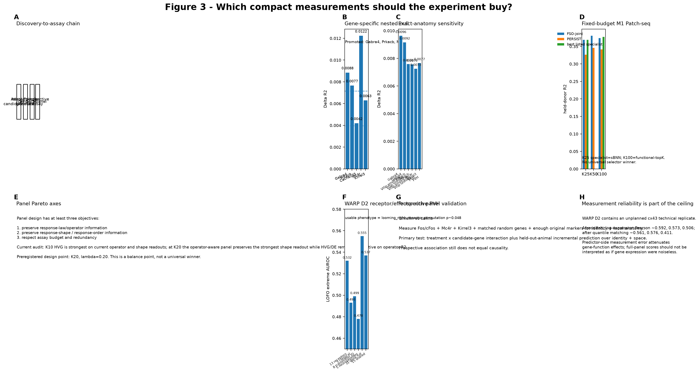

# Q3 — Which additional measurements preserve the recoverable functional coordinates?

> **Current 2026-10-04 browser authority:** [Figure 3 on the scientific results page](../../index.html#fig3) · [source data](../../docs/source_data/20261004/FIG3_CURRENT_AUTHORITY_V3.csv) · [v18 authority](../../docs/current/CURRENT_FIG123_AUTHORITY_V18_20261004.md).

The older v3 image below is retained as a historical requirement layout, not the current numerical authority.

### 2026-10-04 result lock

Figure 3 separates **measured-panel compression**, **true measured hidden-gene replacement**, **inferred/prospective nomination**, and **broad replication**. M1 K25 is the primary fixed-budget anchor (joint R²≈0.369; 84.5% of full1000; Δ vs PERSIST≈+0.042; Δ vs random-p95≈+0.123). Allen HCR K5 gives a dataset-specific held-mouse positive (ΔSpearman≈+0.097; 6/6 mice; BH q=0.046875). Wang provides true hidden-gene validation (5/5 targets beat matched random). WARP K25 approximately matches full31 AUROC (0.556 vs 0.555), which supports compression—not strict replacement. The broad table still has 0/8 BH-q<0.05 rows, so no universal selector claim is allowed.

## Biological question

Once a functional coordinate is shown to be reproducible and molecularly readable, the next problem is experimental: **which genes, spatial coordinates, or projection labels are worth measuring in a compact assay?**

## Measurement blocks

- measured molecular genes;
- atlas-nominated unmeasured genes, after Q2 bridge validation;
- anatomical/spatial coordinates;
- projection/circuit identity;
- compact panels selected for the target functional object.

## Core comparison

Each information block must add held-biological-unit information above what is already measured. Space and projection are treated as optional experts, not universal corrections. Real coordinates/labels must beat matched shuffles.

## Panel-selection baselines

GAP/FSO panel objectives are compared at matched K with random panels and established selection principles such as high-expression/HVG, PERSIST/PERSIST-Ephys, geneBasis, scGeneFit, and Spapros when the required inputs are available.

The goal is not to crown one universal selector. Different objectives—amplitude, functional extremes, within-type resolution, or operator preservation—can favor different panels.

## Projection / spatial datasets

Projection-rich resources and WARP provide positive tests; Shainer, Zhao and periLC/other spatial resources define coding-regime and method boundaries.

## Canonical entry points

- `scripts/400_wang2023_atlaslift_projection.py`
- `scripts/401_bricseq_projection_atlaslift.py`
- `scripts/404_wang2023_projection_atlaslift_strict.py`
- `scripts/406_projection_atlaslift_multidataset.py`
- matched panel-selection code referenced from the manuscript provenance ledger.

## Output

Q3 should end with a **prospective measurement panel or information block ranked by expected held-out functional gain**, together with assay feasibility and matched negative controls—not merely a feature-importance list.
## Current result anchors

The measurement-design result is a saturation law rather than “more plex is always better.” Under the **current strict Bugeon add-gene contract**, measured-only performance is R² 0.03349 / Spearman 0.21718; the best current +100 targeted atlas-only-gene arm is R² 0.03770 / Spearman 0.23326, with larger panels non-monotonic. The older 0.186→0.201 comparison belongs to a different contract and is retained only in provenance.

A newer independent M1 Patch-seq fixed-budget benchmark tests compact assay design directly. At K=25, FSO-joint reaches R² 0.3686 versus PERSIST 0.3266 and random mean 0.1892, while sBNN reaches 0.3691. At K=50, FSO-joint reaches 0.3804 versus PERSIST 0.3457. At K=100, FSO-joint reaches 0.3740, functional-topK 0.3773 and PERSIST 0.3413. The result is therefore a Pareto/design result—not a claim that one selector wins every K. The frozen table reports mean±SD across 10 grouped folds, but the exact upstream M1 Patch-seq publication/accession is still a public-release provenance gate and is explicitly marked pending on the browser Page.

Spatial and projection variables enter only when their own gate is positive. In WARP, a 3-D spatial-neighborhood arm reaches R² ≈ 0.057 versus ≈ 0.022 after coordinate shuffling, whereas other datasets show little or negative spatial increment. Zhao's current positive AtlasLift endpoint is projection PC1 (corrected ΔR² ≈ +0.0134), not visual calcium amplitude.

## Reproduction note

For every proposed measurement block, report the measured baseline, the added block, a matched shuffle of that block, the held-biological-unit delta, and the assay budget. Feature importance without an incremental held-out test is not a Q3 result.

## Data provenance

Exact public sources, molecular-evidence tiers, and question eligibility are summarized in [the question-centric data matrix](../../docs/QUESTION_DATA_MATRIX.md).

## Historical v3 figure-contract readout

The historical v3 Figure 3 contract followed the sequence **set-level atlas state → fully nested single-gene test → exact-anatomy sensitivity → fixed-budget panel → prospective assay**; the 2026-10-04 browser authority above supersedes its numerical status.

- Promoted computational gene nominations: **Gabra4, Prkacb, Mc4r, Kirrel3**. Cacna2d3 remains a specificity control.
- Exact-anatomy sensitivity preserves positive Delta R2 for Gabra4/Prkacb in VISp and Mc4r/Kirrel3 in PVH.
- Independent M1 Patch-seq fixed-budget benchmark: K25 FSO-joint **0.3686**, PERSIST **0.3266**, random **0.1892**, sBNN **0.3691**; K50 FSO-joint **0.3804** vs PERSIST **0.3457**; K100 FSO-joint **0.3740**, functional-topK **0.3773**, PERSIST **0.3413**.
- WARP Dataset 2 is the phenotype-specific receptor/effector example: 13 receptors AUROC **0.532**, classical markers **0.493**, transmitter-identity genes **0.499**, neuropeptides **0.478**, full 31-gene panel **0.555**.
- The prospective PVH assay is Ghrelin vs saline with Fos/cFos + Mc4r/Kirrel3 + matched random genes + identity/anatomy controls.

The design claim is Pareto-optimal information under budget, not a universal panel-selector winner.
