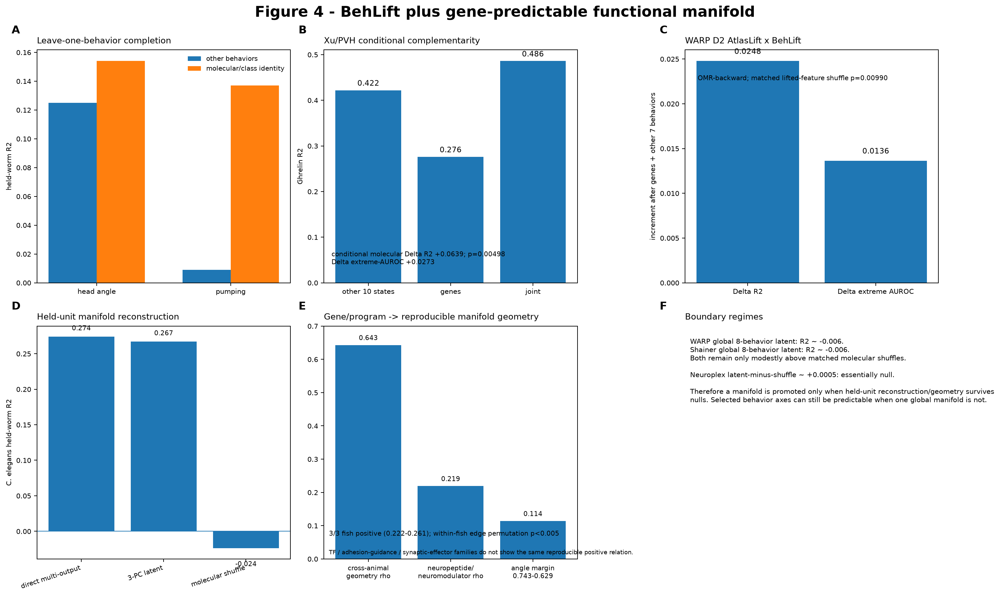

# Q4 — Which unmeasured state or behavior should be measured next?

## Biological question

Paired functional-spatial-omics experiments observe only a small part of an animal's functional repertoire. Q4 treats missing functional coverage as the dual of missing molecular coverage: **can measured states/behaviors and molecular identity predict an omitted functional dimension, and which omitted dimension would provide the most new information if measured?**

## Core analysis

For each behavior/state dimension in turn, hold it out and compare:

1. other measured functional dimensions only;
2. molecular/identity information only;
3. molecular + other functional dimensions;
4. matched behavior/state and molecular correspondence nulls.

Latent functional manifolds are learned only inside the training biological units before projection/reconstruction of the held-out units.

## Main systems

*C. elegans* provides a circuit-complete multi-behavior test; WARP and Shainer provide multi-response visual/behavior batteries; Xu/PVH provides an internal-state complementarity regime.

## Representation baselines

Raw measured response vectors, simple PCA/low-rank latent models, CEBRA-style behavior-aligned representations where matched, and GAP/BehLift conditional models are evaluated on the same omitted target.

## Canonical entry points

- `scripts/108_behlift.py`
- `scripts/110_panel_pareto_unified.py`

## Output

The main output is an empirical **next-measurement utility**: the fraction of local predictive headroom closed by measuring another state/behavior versus another gene, projection label, spatial coordinate, or more repeats. This converts model performance into an experiment-design decision.
## Current result anchors

In C. elegans, molecular/class information predicts reversal and velocity strongly (held-worm R² ≈ 0.517 and 0.486), while a training-derived low-dimensional functional representation reconstructs the held-worm behavior space at R² ≈ 0.267, close to the direct recoverable signal (≈0.274) and well above a negative shuffled control. This is the clearest example of a reusable functional coordinate rather than a decorative embedding.

WARP shows that omitted behaviors can be much more predictable from the remaining functional battery than from genes alone: the other seven responses predict held-out looming-left at R² ≈ 0.334, while the gene-only increment is much smaller but reproducible. In WARP D2, lifted molecular identity still adds information after the other behaviors are already present for OMR-backward (conditional ΔR² ≈ +0.0248; empirical p ≈ 0.0099).

CEBRA is retained as a representation baseline rather than a replacement for conditional completion. On WARP looming-right, late fusion gives a small positive increment (R² 0.197920 → 0.199613) with all three held fish positive, illustrating that a representation can help downstream without becoming the biological endpoint.

## Reproduction note

The omitted state/behavior must be absent from representation learning in the held biological unit. Report behavior-only, molecule-only, combined, and matched-null models side by side; then express the gain as predictive headroom closed when comparing candidate next measurements.

## Data provenance

Exact public sources, molecular-evidence tiers, and question eligibility are summarized in [the question-centric data matrix](../../docs/QUESTION_DATA_MATRIX.md).

## Manifold interpretation

The latent functional manifold is a **prediction target**, not a visualization endpoint. A manifold is promoted only when it is learned in training biological units and reconstructs/predicts held-out functional dimensions. Decorative UMAP separation without held-unit reconstruction does not count as Q4 evidence.

## Exact v3 figure readout

Figure 4 now makes the functional manifold a held-biological-unit prediction target and explicitly asks which molecular programs organize that geometry.

- Xu/PVH Ghrelin: other ten states R2 ~**0.422**, genes ~**0.276**, joint ~**0.486**; conditional molecular Delta R2 **+0.0639**, p=0.00498, Delta extreme-AUROC **+0.0273**.
- WARP D2 OMR-backward: AtlasLift x BehLift conditional Delta R2 **+0.024776** and Delta extreme-AUROC **+0.013643**, matched-shuffle p=0.00990.
- C. elegans: direct multi-output molecular prediction R2 **0.274**, three-PC latent reconstruction **0.267**, molecular shuffle **-0.024**.
- WARP reproducible temporal geometry has cross-animal Spearman **0.643**. Neuromodulator/neuropeptide family-distance predicts functional-subspace distance with pooled rho **0.219**, positive in all three fish (**0.222-0.261**), permutation p<0.005.
- TF, adhesion/guidance and synaptic-effector families do not show the same reproducible positive relationship.

WARP/Shainer global eight-behavior latent R2 values near -0.006 and the approximately null Neuroplex result remain visible boundary regimes.

## Current 2026-10-04 tool result

The current browser authority uses biology-aware completion and multimetric held-unit evidence. C. elegans, Sorensen, Xu, Bugeon, Allen VC2P and WARP contain positive molecular headroom under specific targets; Zhao, Condylis, FLiCRE and sparse-panel systems remain visible boundaries. A positive delta R2 alone is not sufficient.
