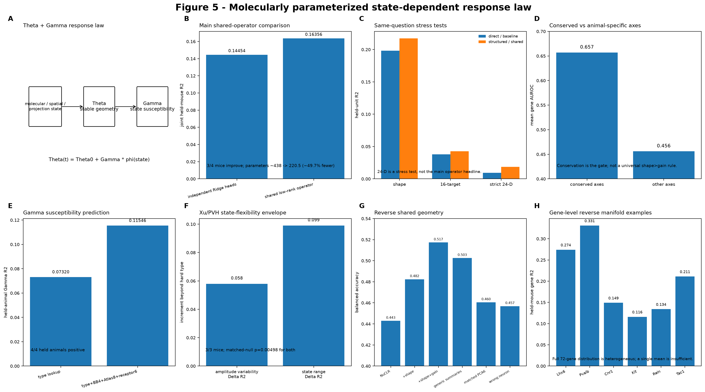

# Q5 — How does molecular identity parameterize a state-dependent response law?

## Biological question

A neuron can retain a stable response organization while state, stimulus, history, and network context alter how strongly that organization is expressed. Q5 asks whether molecular identity predicts **stable response-law coordinates and state susceptibility**, rather than every coefficient of a high-dimensional activity trace.

## Nested model

A minimal response-law model separates a stable component from state susceptibility:

- `Θ`: stable response geometry / response shape;
- `Γ`: how state or context shifts the response law;
- current activity: expression of those coordinates under the present stimulus/state/history.

The operator earns value only when the functional coordinate is reliable and the molecularly conditioned controller improves held-biological-unit prediction over a matched global/context-only controller.

## Classical baselines

Regularized response-kernel/GLM models, autoregressive history models, direct Ridge/RRR specialists, and behavior-aligned representations such as CEBRA provide matched controls. A specialist may outperform GAP on a narrow scalar target; the operator claim concerns reusable response-law structure.

## Bidirectional validation

A stronger test reverses the inference direction: functional geometry learned only from training animals should add molecular identity/manifold information in untouched animals. Matched-dimensional random activity projections and neuron-identity shuffles test whether the correct functional geometry is assigned to the correct cell.

## Canonical entry points

- `scripts/102_bugeon_lowdim_state_controller.py`
- `scripts/103_bugeon_scalar_controller_validation.py`
- `scripts/104_bugeon_scalar_controller_compact.py`
- `scripts/105_bugeon_ranked_controller.py`

## Interpretation

The operator is a structured observational model, not causal proof. It becomes mechanistic only when perturbing a nominated molecular handle shifts the preregistered response-law coordinate while orthogonal coordinates remain comparatively preserved.
## Current operator authority

The main operator-vs-linear comparison is now the six-task shared-structure benchmark. Independent Ridge heads give joint held-mouse R² **0.14454**; a shared low-rank operator gives **0.16356** while reducing the effective parameter count from about 438 to 220.5 (~49.7% fewer), with 3/4 held mice improving.

Supporting matched stress tests point in the same direction: response-shape geometry improves approximately 0.19822→0.21721, a 16-target operator approximately 0.03774→0.04280, and the strict 24-D state-kernel stress test Direct Ridge 0.00927→structured 0.01852. The 24-D value is intentionally labelled a stress test, not the overall operator performance.

Gamma/susceptibility is a different prediction target. Under the current exact 633-cell LOAO screen, type lookup is approximately R² 0.0732; type + BrainBeacon4 + Atlas8 + receptor6 Ridge reaches **0.11546 with 4/4 held animals positive**, and the type-residual version reaches approximately 0.11585 with 3/4 positive. This result supports a receptor/context susceptibility layer; it is not an operator-vs-linear score.

## Current result anchors

In Bugeon, the fully nested low-dimensional molecular controller improves held-animal state-kernel prediction from R² = 0.004094 for the matched global controller to 0.015639 (ΔR² = +0.011546), with MSE improving in 4/4 held animals. A one-dimensional signed state-gain coordinate has split-half reliability ≈ 0.371 and is molecularly predictable (R² ≈ 0.100; Spearman ≈ 0.333).

The key biological refinement is that molecular readability is concentrated in cross-animal-conserved operator axes. The two axes with cross-animal stability above 0.99 have mean gene AUROC ≈ 0.657, versus ≈ 0.456 for the other ten axes.

The reverse test independently supports the same geometry. Across untouched mice, NuCLR molecular-identity decoding rises from mean balanced accuracy 0.4429 to 0.4824 with response shape and 0.5173 with shape+gain. An independently trained GAP native activity encoder reproduces the hierarchy (0.4822 → 0.5176 → 0.5438). Matched-dimensional and wrong-neuron controls are lower.

## What is promoted and what remains open

The promoted Q5 object is **a family of molecularly constrained susceptibility coordinates**. Bugeon shows a reliable state-conditioned operator and conserved, gene-readable axes. Xu/PVH independently shows that continuous molecular state predicts the amplitude envelope/range over which a neuron varies across 11 conditions beyond hard type.

This does not mean that every Gamma-like quantity is solved. Generic molecular embeddings plus a function-aligned core still leave absolute held-animal log-gain/Gamma prediction below zero in the current external representation audit. The missing layer is therefore treated as a testable context/receptor/state/history hypothesis.

Q5 should also not be conflated with Q6. Q5 asks **what response law exists and which of its coordinates are molecularly specified**. Q6 asks **whether a recovered coordinate can be reused with fewer target labels or in a biologically aligned new system**.

## Reproduction note

Q5 should be read in this order: establish coordinate reliability → fit a matched global/context controller → add molecular conditioning → test conserved-axis readability → reverse the direction in untouched biological units. Architecture names are secondary to this sequence.

## Data provenance

Exact public sources, molecular-evidence tiers, and question eligibility are summarized in [the question-centric data matrix](../../docs/QUESTION_DATA_MATRIX.md).

## External abstraction-level stress test

Two new external baselines sharpen what Q5 is and is not claiming. A bio-trained Allen/Ito/Arkhipov-style 67K V1 simulation reproduces population response distributions far better than XC64 on the matched 1-KS benchmark, yet held-donor single-cell OSI/DSI R² remains negative. This shows that mechanistic population realism does not by itself identify which held-out neuron occupies which functional coordinate.

BrainBeacon provides the complementary molecular test. Its raw 1024-D embedding is not automatically a better response-law decoder than the measured 71-gene input, but a matched low-dimensional PCA4 representation improves the dominant response-shape axis, especially with limited target labels. The same representation does not solve log-gain / Gamma-like susceptibility.

Together these results motivate a modular operator architecture rather than a larger monolithic encoder: `general molecular encoder → function-aligned core → context/receptor susceptibility layer`. See [external baseline boundaries](../../docs/EXTERNAL_BASELINE_BOUNDARIES.md).

For the code-level architecture in biological terms, see [model architecture by biological operation](../../docs/MODEL_ARCHITECTURE_BY_BIOLOGY.md).

## Cross-state flexibility: a second form of susceptibility

Xu/PVH now supplies a null-controlled cross-state test that is complementary to the Ghrelin–Saline Gamma coordinate. Across 11 conditions, continuous molecular state predicts **how broadly a neuron can vary across states** beyond hard type. Held-mouse amplitude variability improves from hard-type R² = -0.0005 to type+genes R² = 0.0574 (ΔR² = +0.0580), and total state range improves from -0.0059 to 0.0931 (ΔR² = +0.0990). Both increments are positive in 3/3 held mice and exceed 200 matched gene shuffles within animal × molecular type (empirical p = 0.00498 for both).

The boundaries are equally informative. Condition selectivity is positive in all three mice but does not cross the matched-null threshold (p = 0.0697). Temporal shape diversity has a positive type→gene increment relative to null (p = 0.0448) but remains negatively calibrated in absolute R². We therefore promote **cross-state amplitude envelope / range**, not generic temporal complexity.

Canonical entry points:
- `scripts/613_xu_functional_flexibility_20260929.py`
- `scripts/614_xu_functional_flexibility_null_20260929.py`

Biological reading: molecular identity can specify not only a stable response coordinate, but the envelope over which context can move that coordinate.

## Exact v3 figure readout

The current Figure 5 authority separates **shared operator structure** from **molecular prediction of susceptibility**.

- Main shared-operator comparison: independent Ridge heads R2 **0.14454** → shared low-rank operator **0.16356**, with parameters ~438→220.5 (~49.7% fewer) and 3/4 held mice improving.
- Supporting matched stress tests: response-shape geometry **0.19822→0.21721**; 16-target **0.03774→0.04280**; strict 24-D **0.00927→0.01852**. The 24-D result is a stress test, not the overall headline.
- Conservation gate: mean gene AUROC ~**0.657** on conserved operator axes versus ~**0.456** on other axes.
- Gamma molecular prediction: type lookup R2 ~**0.0732**; type + BrainBeacon4 + Atlas8 + receptor6 ~**0.11546**, 4/4 held animals positive.
- Xu/PVH independently supports a susceptibility envelope: amplitude-variability Delta R2 **+0.0580**, state-range Delta R2 **+0.0990**, both 3/3 mice with p=0.00498.
- Reverse shared geometry: NuCLR bACC **0.4429→0.4824→0.5173** after adding response shape and then shape+gain.

The wording lock is therefore **conserved versus animal-specific axes**, not a universal “shape > gain” rule.

## Current 2026-10-04 tool result

The current matched operator contract is same X / same Y / same held-biological-unit folds. Bugeon exact 24D is the primary structured response-law anchor; Xu and Sorensen independently replicate multimetric gains. Structural projection/connectivity prediction is also supported in Chevee, C. elegans, MERGE-seq and Sorensen, without claiming that shared low-rank structure must always beat direct Ridge.
