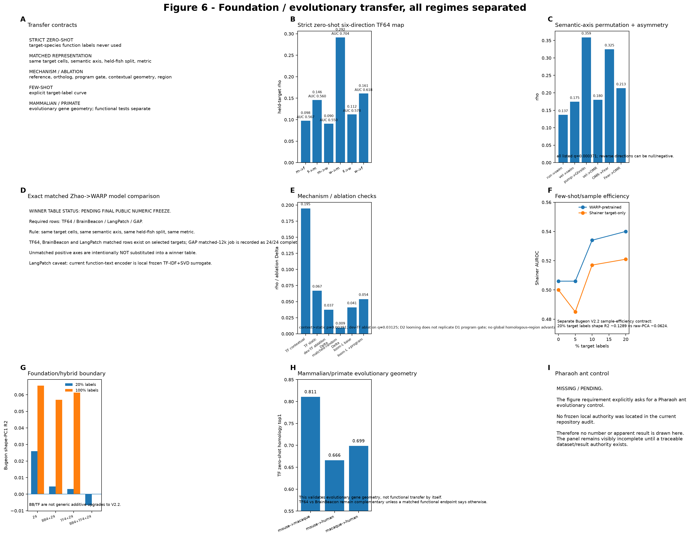

# Q6 — Are recovered molecular-functional coordinates reusable in new animals and systems?

## Biological question

A representation is scientifically useful only if it reduces the amount of new paired functional/molecular data required in a new biological replicate or aligned system. Q6 therefore evaluates **held-unit sample efficiency and ontology-matched transfer**, not parameter count or embedding similarity.

## Same-system sample efficiency

Pretraining/shared representations are compared with matched target-only baselines at the same fraction of labeled target-domain cells. Continuous response-law coordinates and discrete functional tokens are evaluated separately.

## Cross-system transfer gate

A transfer is promoted only when:

1. the source functional coordinate is predictable inside the source dataset;
2. source and target share an explicitly named biological token/ontology;
3. the real correspondence beats condition-permuted, neuron-shuffled, or equal-dimensional random controls;
4. held-out biological units in the target improve with limited target labels.

Geometry alone is not ontology. Arbitrary `PC1 → PC1` transfer is not a biological test.

## Boundary with the operator question

Q6 does not decide what Gamma is. A model can be useful for low-label response-shape transfer and still fail to predict state susceptibility. Conversely, a Q5 operator can identify a molecularly readable susceptibility coordinate without demonstrating cross-system reuse.

BrainBeacon and V2.2 therefore have two clearly separated roles: in Q5 they help localize which representation layer is still missing; in Q6 they are tested on an explicit target-label curve. The same numerical model should not be described as one global winner across both questions.

## Baselines

Target-only Ridge/PCA or another capacity-matched specialist; atlas-only molecular representations; generic molecular foundation embeddings; source-gated/shared GAP representations; cross-species reference experts where homologous molecular and functional variables exist.

## Canonical entry points

- `scripts/520_foundation_v20_arch_sweep.py`
- `scripts/521_eval_foundation_v20_sweep.py`
- `scripts/522_foundation_v21_parallel.py`
- `scripts/523_eval_foundation_v21_parallel.py`
- `scripts/526_cv_gap_v21_factorized.py`
- `scripts/527_cv_v22_expanded_compact.py`
- `scripts/531_cv_gap_factor_compact_hybrid.py`
- `scripts/535_cv_gap_crossspecies_refexpert.py`

## Interpretation

The current claim is not a universal neural foundation model. The defensible question is whether biologically matched pretraining preserves a reusable functional coordinate and reduces paired-label demand in a new animal/system.
## Current result anchors

The **primary current transfer contract is target-excluded**, rather than the older within-Bugeon label-efficiency example. With Xu+Zhao as sources and Bugeon excluded from pretraining, Gamma-PC1 improves relative to Raw-PCA by approximately +0.133 R² at 5% target labels, +0.104 at 10% and +0.053 at 20%; at 20% the Foundation reaches slightly positive absolute R² (~0.0047) with Spearman ~0.368. Theta-PC1 shows an even larger ~+0.279 relative gain at 5%.

A second primary test reverses the source-target direction: Bugeon→Zhao semantic few-shot transfer at 10% target labels improves sustainedness by ~+0.481 R², grating mean by ~+0.674 and temporal variability by ~+0.612 relative to target-gene PCA; all three improve in 7/7 held animals. Absolute calibration is still reported separately.

The strict WARP OTpv→Shainer looming authority supersedes older circulated 0.5166/0.5459 values: zero-shot AUROC is **0.5063**; at 5% labels **0.5055 vs 0.4848** (4/6 fish), at 10% **0.5337 vs 0.5172** (5/6), and at 20% **0.5404 vs 0.5211** (4/6). The supported claim is therefore few-shot semantic reuse with target calibration, not universal zero-shot transfer.

A separate pretraining audit shows why biological matching matters: region-matched ABC cluster-mean pretraining improves the matched Bugeon target, whereas naive much-larger MERFISH pretraining is neutral or slightly negative. Scale alone is therefore not the transfer hypothesis.

## Reproduction note

Always plot performance against target-domain label budget and include a target-only baseline at every budget. Cross-system claims additionally require an explicit shared biological ontology and correspondence controls; embedding similarity alone is insufficient.

## Data provenance

Exact public sources, molecular-evidence tiers, and question eligibility are summarized in [the question-centric data matrix](../../docs/QUESTION_DATA_MATRIX.md).

## External representation update

BrainBeacon now provides an independent molecular-foundation baseline under the same held-animal target-label curve. On the Bugeon response-shape PC1 endpoint, BrainBeacon PCA4 exceeds matched raw71 PCA4 at 10% labels (0.0297 vs -0.0159) and 20% labels (0.1213 vs 0.0836). A BrainBeacon + frozen V2.2 Z4 hybrid becomes useful only after more target calibration: it is worse at 10%, modestly better at 20-50%, and reaches R² 0.2066 versus 0.1845 for BrainBeacon alone at full labels.

This changes the transfer interpretation in an important way. A generic molecular encoder can supply a reusable Theta-like prior, but a function-aligned core needs enough target calibration to add value, and neither resolves Gamma. The evidence therefore supports modular, endpoint-specific transfer rather than a single universally sample-efficient foundation representation.

## Latest three-species extension

A newer transport-space analysis across mouse, zebrafish and C. elegans identifies selective semantic transfer axes and tests whether the correct cross-species gene geometry matters. It is intentionally kept separate from the frozen main Figure 6 contract.

See [Cross-species extension — 2026-09-30](../../docs/CROSS_SPECIES_EXTENSION_20260930.md) for the current TranscriptFormer contextual-geometry, gene-program, reciprocal-axis and primate-homology results.

## Exact v3 figure readout

Figure 6 now separates transfer regimes instead of collapsing them into one model leaderboard.

- Strict zero-shot TF64 held-target Spearman rho: mouse→fish **0.09766**, fish→mouse **0.14599**, mouse→worm **0.09049**, worm→mouse **0.29161**, fish→worm **0.11236**, worm→fish **0.16082**.
- Selected semantic-axis transfers survive target-group-preserving permutation/FDR, but reverse directions can be null or negative.
- The exact matched Zhao→WARP TF64 / BrainBeacon / LangPatch / GAP winner table is **PENDING FINAL PUBLIC NUMERIC FREEZE**. No unmatched positive row is substituted. The current LangPatch arm is explicitly a local frozen TF-IDF+SVD function-text surrogate.
- Contextual TranscriptFormer geometry is stronger than static geometry on the validated locomotor/visual-motor transfer; program-gating effects are axis-specific rather than universal.
- Strict WARP→Shainer zero-shot remains near chance; few-shot support appears with target calibration.
- TranscriptFormer zero-shot homology top1: mouse→macaque **0.81065**, mouse→human **0.66617**, macaque→human **0.69872**. This is evolutionary gene geometry, not functional transfer by itself.
- The required **Pharaoh ant** control remains **MISSING/PENDING** because no frozen traceable local result authority was found.

The current claim is selective biologically aligned reuse, not a universal zero-shot neural foundation model.

## Current 2026-10-04 tool result

Transfer claims now require two separate conditions: route/hyperparameter selection is source-only, and - when target labels exist - the target evaluation must support the final claim. The new prespecified Allen-HCR->Zhao visual-evoked route has positive source OOF but negative target rho and is therefore classified as EXECUTED_NO_TARGET_TRANSFER, not as conservation.
